<!-- DRAFT: generated, pending author rewrite -->

# TUNING.md — turning 1015 raw findings into 242 that matter

> **This is a structural draft.** The numbers and tables are real and measured;
> the prose is a scaffold for the author to rewrite in their own voice before
> this repo is used in an application. See `docs/DEFENSE.md` for the reasoning of
> record and `docs/tuning-record.md` for the Stage-A target-selection detail this
> builds on.

Anyone can enable five scanners. The deliverable of this project is the *tuning*:
the decisions that take a wall of 1015 raw findings down to the 242 a reviewer
should actually act on, and the justification for every finding dropped along the
way. This document is that argument, measured against a real target.

**Target:** `polonel/trudesk` @ `29f3f1698f341e3d8fcc4f4eb5340ee43427fe63`
(a ~3-year-stale Node.js helpdesk app; 2402 resolved packages). Chosen in Stage A
precisely because it gives the gate real work — see `tuning-record.md`.

---

## 1. The triage funnel

| Stage | Count | What was removed, and why |
|---|---:|---|
| **Raw findings** | **1015** | Everything the five scanners emit: OSV 441 (app deps) + Trivy 425 (image: 402 language-pkg + 23 OS) + Semgrep 149 (SAST, unscoped) |
| After scoping | 974 | SAST restricted to first-party source (149 → 108). The 41 dropped are in vendored/bundled trees — see §2 |
| Gated layers | 572 | The report-only image **language** layer (402) is set aside: it overlaps the OSV app-dep layer, so gating it double-counts. It is published, not gated (§3) |
| Meets policy | 243 | Severity floor (HIGH+) / KEV / EPSS applied to the 572 gated candidates |
| **Blocking** | **242** | After the fix-availability relaxation drops 1 unfixable HIGH to report-only (§5) |

**76% of raw findings are noise** for the purpose of a merge gate — not "wrong,"
but not a reason to block *this* change. The funnel is the argument that a
severity-only gate (which would surface ~243 with no further discrimination) is
the wrong tool.

Raw data behind the chart: `examples/evidence/funnel.csv`,
`examples/evidence/scan-manifest.json`. Regenerate with
`python scripts/build_evidence.py …` (exact invocation in that script's header).

---

## 2. SAST scoping: 149 → 108, and why the 41 are not false *positives*

Semgrep on the whole tree returns **149** findings; scoped to first-party source
it returns **108**. The excluded paths:

| Excluded | What it is | Why excluded |
|---|---|---|
| `src/public` | ~119k lines of bundled/minified front-end JS | Build output, not source we author; findings here are un-actionable at the source level |
| `mobile/lib` | ~186k lines of vendored mobile libraries | Third-party vendored code; owned by upstream, not this repo |
| `node_modules`, `test` | dependencies / test fixtures | Dependencies are covered by the *dependency* scanners (OSV/Trivy), not SAST; test fixtures are not shipped |

**Confidence: `[medium]`.** These are *scoping* decisions (which code the SAST
gate is responsible for), not per-finding false-positive calls. The claim is
"Semgrep on bundled/vendored code is the wrong layer to gate," which is standard,
not a semantic judgement about any specific finding. The honest caveat: a real
vulnerability *could* live in vendored code — scoping trades that recall for a
gate that developers can act on. That trade is the point, and it is reversible
(the exclude list is one workflow input).

Of the 108 scoped SAST findings, only **2 are HIGH** (Semgrep `error` level);
106 are MEDIUM/below and are reported, not gated.

---

## 3. The OSV / Trivy layer split (why 402 findings are report-only)

OSV-Scanner sees **441** vulns on the source `yarn.lock`. Trivy sees **402**
language-package vulns on the *built image*. These are the same class of finding
(npm dependency CVEs) from two vantage points, and they overlap heavily.

**Decision: OSV gates the app-dep layer; Trivy's language layer is report-only;
Trivy gates only the OS layer.** Gating both language views would count the same
CVE twice and corrupt the funnel. The 402 are published (the OSV-vs-image delta
is itself signal: build-time pruning and dev-dep stripping change what actually
ships) but never block. On this target that is 402 findings correctly kept out of
the gate. Full reasoning: `tuning-record.md` F2, `DEFENSE.md` D1.

---

## 4. The headline result: severity is not risk

Two findings drive the whole design.

### 4a. Zero known-exploited vulnerabilities (KEV = 0)

trudesk carries **204 High + 29 Critical** advisories (by the recon count; the
gate's adapter, using GHSA text severity, counts 202 / 26 — a reconciliation
item, `DEFENSE.md` JC-7) and **not one** appears in the CISA KEV catalog (1653
entries, version 2026.07.23). A severity-only gate would dump 200+ "Critical/High"
on a reviewer with no way to tell which are actually being exploited. **None are.**
That is the empirical case for the model: severity floors alone are noise
generators on a stale codebase.

### 4b. EPSS escalates 4 below-floor OpenSSL CVEs the severity floor would miss

Conversely, the model *catches* risk a floor misses. Four OS-layer findings rated
only **MEDIUM** block anyway, escalated by EPSS:

| CVE | Package | Severity | EPSS | Why it blocks |
|---|---|---|---:|---|
| CVE-2023-2650 | libcrypto1.1 / libssl1.1 @ 1.1.1n | Medium | **0.751** | 75% 30-day exploitation probability — a MEDIUM the floor would let through |
| CVE-2022-4304 | libcrypto1.1 / libssl1.1 @ 1.1.1n | Medium | 0.162 | Above the 0.10 escalation threshold |

These are OpenSSL 1.1.1n vulnerabilities. A pure severity floor (HIGH+) reports
them; the EPSS axis blocks them. This is the model earning its keep on real data.

### 4c. On this target, EPSS escalation is inert on the *dependency* layer

Full disclosure, because it matters: among the 213 below-floor **dependency**
findings, the highest EPSS is **0.073** — below the 0.10 threshold. So EPSS
escalation fires on the OS layer (§4b) but **not once** on the app-dep layer.
Lowering the threshold to 0.05 would escalate the 0.073 finding; 0.10 is the
current default (`gate/policy.py`). This is a genuine tuning knob with a visible
effect, and the honest story is "the escalation axis is target-dependent."

---

## 5. Fix-availability relaxation: 243 → 242

Of the findings that meet the policy, one HIGH dependency finding has **no fix
available** (no patched version exists). The gate downgrades it from blocking to
*reported*: you cannot act on it in this PR, and a gate that blocks a merge on
something undevelopable is one people learn to bypass. It is surfaced, not hidden;
and had its EPSS been over threshold, urgency would have overridden actionability
and it would block regardless. (Only **2 of 441** OSV findings lack a fix — this
codebase is stale, so nearly everything is patchable; the relaxation matters more
on actively-maintained targets.)

**Confidence: `[measured]`** — fix availability comes from the advisory's
`affected[].ranges` carrying a `fixed` event, not inference.

---

## 6. Suppressions: none applied to the target audit (and why)

The authoritative trudesk audit applies **zero** suppressions. Two reasons:

1. Every suppression is a semantic claim about the target's code. Verifying
   trudesk internals well enough to make those claims safely is out of scope for
   autonomous execution — writing confident suppressions I cannot defend would be
   the single worst failure mode of this working mode (`DEFENSE.md` §0).
2. The gate's delta model means most inherited noise is handled by the
   *merge-base* axis on real PRs, not by hand-written suppressions.

The suppression **mechanism** is still exercised — by unit tests
(`tests/test_engine.py`) and a worked example (`examples/suppressions.example.yml`)
with an explicitly low-confidence, clearly-scoped entry. See the suppression
register in `DEFENSE.md` §2.

---

## 7. Performance

| Stage | Duration | Note |
|---|---:|---|
| OSV-Scanner (yarn.lock, 2402 pkgs) | **2.8 s** | offline advisory DB; `[measured]` |
| Semgrep (unscoped, ~450k lines) | ~90 s | `[measured, approximate]` |
| Semgrep (scoped) | ~35 s | scoping is also a speed win; `[measured, approximate]` |
| Trivy (image, 1728 components) | ~30 s | `[measured, approximate]` |
| **ci-gate** (all inputs + 351k-row EPSS parse) | **0.56 s** | the gate itself is negligible; `[measured]` |

The gate adds well under a second to a scan measured in minutes — the cost is the
scanners, and scoping cuts the dominant one (Semgrep) by ~60%.

---

## 8. Open reconciliation items

- **Severity counts (JC-7):** adapter reports 26 C / 202 H; recon reported 29 / 204.
  Different severity sources (GHSA text vs. CVSS numeric). Pick one, make the
  tuning record and the engine agree.
- **Semgrep drift:** recon measured 145/91 unscoped/scoped; this run 149/108. The
  ruleset (`p/default`, `p/javascript`) moved between runs. Pin the ruleset
  version for a reproducible number.
- **Durations** marked approximate should be re-measured with `/usr/bin/time` in
  one clean pass for the final report.
